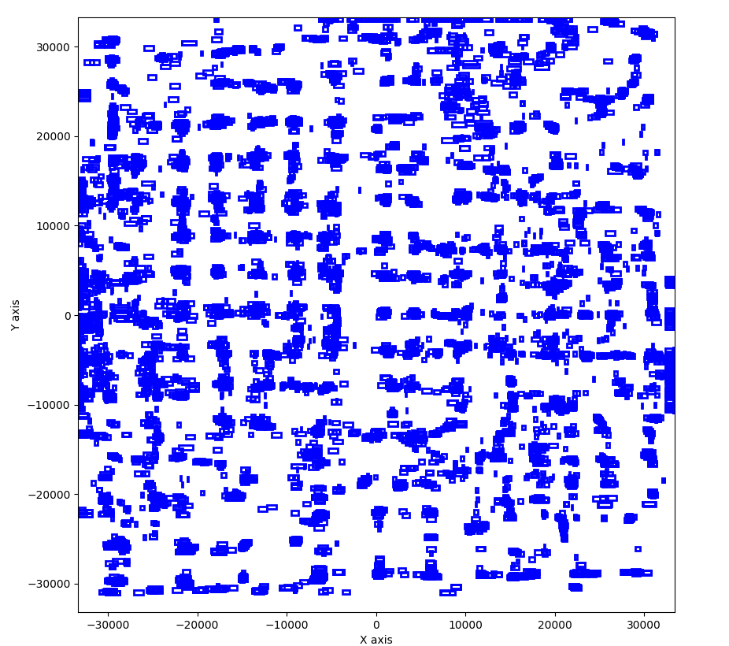
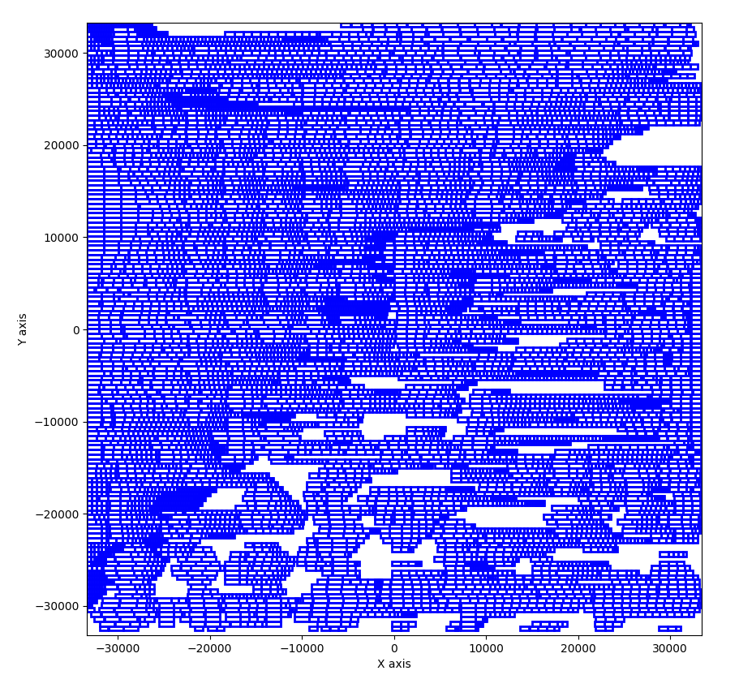

# Standard Cell Placement Legalization

## Objective

This project implements a standard cell placement legalization algorithm. The goal is to transform an initial global placement result (which may contain overlapping standard cells) into a legal, overlap-free placement that satisfies all site constraints. The program aims to minimize two key metrics:

- **Total Displacement**: The sum of Manhattan distances between original and legalized positions for all cells.
- **Maximum Displacement**: The maximum individual displacement among all cells.

## Problem Context

In digital integrated circuit (IC) design, placement legalization is a critical step after global placement and before detailed placement and routing. It ensures that all standard cells are placed in legal, aligned positions on the chip grid without any overlap. A good legalization can reduce wirelength, improve routability, and enhance circuit performance.

## Input Format

The program reads input files in the [GSRC Bookshelf format](http://vlsicad.eecs.umich.edu/BK/ISPD06bench/BookshelfFormat.txt), including:

- `.aux`: Entry point listing all other input files
- `.nodes`: Cell definitions (name, size)
- `.nets`: Netlist for connections
- `.pl`: Initial placement
- `.scl`: Row and site definitions
- `.wts`: Optional cell weights

## Output Format

- A new `.pl` file containing legalized cell coordinates
- Console output that reports:
  - Total displacement
  - Maximum displacement

## Legalization Flow

### 1. File Parsing
All Bookshelf files are parsed to construct data structures that describe the layout, cells, and rows.

### 2. Rect Construction
Each standard cell is converted into a rectangle structure containing x/y position, width, and height.

### 3. Modified Tetris Legalization
- Cells are sorted by descending size (width + height).
- For each cell:
  - Traverse rows and find candidate intervals.
  - If the row has fewer than 15 intervals, try all possible site positions.
  - If the row has many intervals, evaluate only the left and right ends of each interval.
  - Select the legal location with minimum Manhattan distance to original position.

### 4. Simulated Annealing (SA)
- Refines the placement result from the Tetris step.
- Randomly selects cells with the same width and attempts to swap their positions.
- Accepts or rejects changes based on SA criteria (energy difference and temperature).

### 5. Cost Calculation
For cell \( i \):

\( d_i = |x_i^{gp} - x_i^{legal}| + |y_i^{gp} - y_i^{legal}| \)

- **Total Displacement**: \( D_{total} = \sum_{i} d_i \)
- **Maximum Displacement**: \( D_{max} = \max_{i}(d_i) \)

## Techniques Used

- Tetris-style greedy legalization
- Interval list management for available space
- Sliding refinement inside large intervals
- Simulated annealing with dual-neighborhood (swap and slide)
- Manhattan distance objective

### Compilation

```bash
make clean && make
```
### Execution

```bash
./PA3 <input_directory> <input_aux_file> <output_name>
```

### Example

```bash
./PA3 toy toy.aux output
./PA3 ibm01 ibm01.aux output
```
#### Example Visualization

Below is the original global placement for the benchmark `ibm01`:

The program outputs `output.pl` and reports cost metrics.

Below is the result of global placement for the benchmark `ibm01`:

```text
Total displacement: 52839296.0  
Maximum displacement: 31840.0  
```

## Reference

- [Bookshelf File Format](http://vlsicad.eecs.umich.edu/BK/ISPD06bench/BookshelfFormat.txt)

## Author

This project was developed as part of CAD Design Project 3: Standard Cell Placement Legalization

Due Date: November 6, 2024